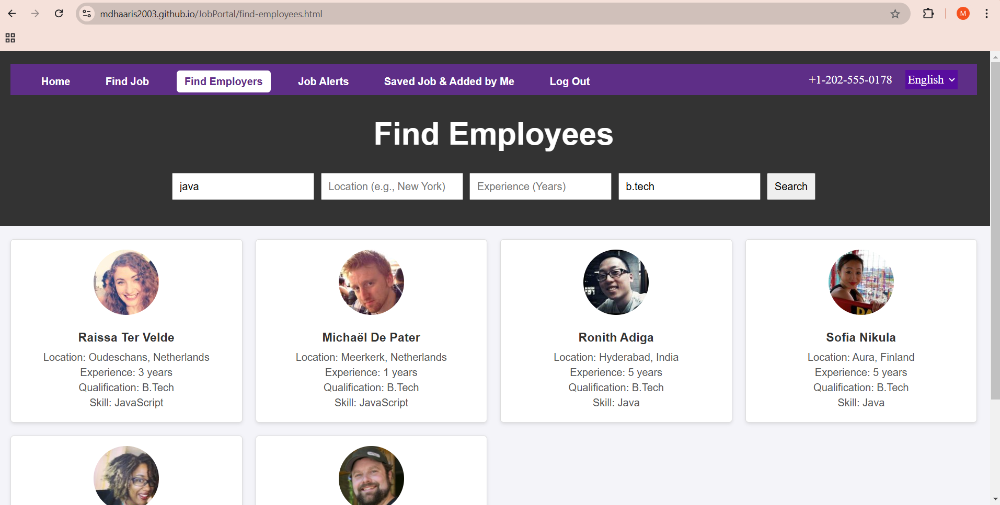

# **Job Portal Application**
 Portal Link- https://mdhaaris2003.github.io/JobPortal/
## **Overview**

The **Job Portal Application** is a comprehensive platform designed to connect job seekers with employers. Users can explore job listings and save their preferred opportunities.The platform utilizes Firebase for database storage and authentication to ensure a secure and efficient user experience. It is hosted on GitHub Pages for easy access.

## **Features**

- **User Authentication**: Secure login and registration for both job seekers and employers using **Firebase Authentication**.
- **Job Listings**: Browse available job listings with advanced search filters.
- **Job Applications**: Apply for jobs directly through the portal.
- **Profile Management**: Job seekers can create and update their profiles, stored securely in the **Firebase Database**.
- **Employer Job Management**: Employers can view and manage posted job openings.

## **Technologies Used**

### **Frontend**

- **HTML**
- **CSS**
- **JavaScript**

### **Backend**

- **Firebase Authentication**: Secure user login and registration.
- **Firebase Realtime Database**: Storing job listings, applications, and user profiles.
### **Application Hosted in GitHub pages**
You can access the job portal at the following link:
(https://mdhaaris2003.github.io/JobPortal/))


## **Application Images**

### **Homepage**


### **Login page**


### **Register page**


### **Job Listings**


### **Job Listings after Filters being applied**


### **Popup when a job is saved/bookmarked**


### **Saved Jobs**


### **Find-Employees**
Random Employee details fetched from the API: **https://randomuser.me/api/**



### **Firebase Integration for Database and Authentication**

**Firebase Realtime Database**


**Firebase Authentication**


## **Installation**

### **Steps to View the Portal**

1. **Clone the Repository**:
   ```bash
   git clone https://github.com/mdhaaris2003/JobPortal.git
   cd JobPortal

2. **Open the Application in Browser**:
Open the index.html file directly in your preferred browser (e.g., Chrome).
